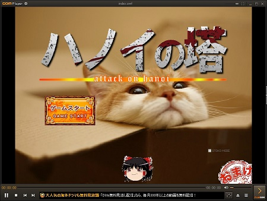
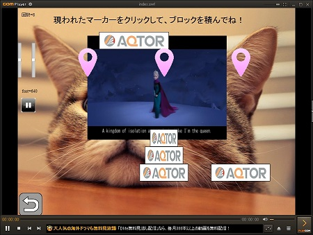

# TobisakoHanoiGame

このゲームは、会社同僚を集めて勉強会を開催した際に、お題として私が作成しました。  
「ハノイの塔って何？」という場合は、下記wikiをご確認下さい。  
<https://ja.wikipedia.org/wiki/%E3%83%8F%E3%83%8E%E3%82%A4%E3%81%AE%E5%A1%94>

シンプルなハノイの塔です。  
背景に動画（LetItGo）を再生し、タイムアップになる前にクリアしましょう。  
UIはシンプルですが、サクサク動いて気持ちいいかもです。

# 環境
本プログラムは、下記環境で構築しています。  
　　FlashDevelop 4.6.4.1 for .NET 2.0  
　　MinimalComps（ライブラリ。gitフォルダに入れているので入手不要です。）  
　　Progression4（ライブラリ。gitフォルダに入れているので入手不要です。）  
※環境構築は、以下サイトを参考にして下さい。  
 <http://clockmaker.jp/blog/2009/07/tutorial-install-flashdevelop-flex-sdk/>

また、背景動画（mp4）に、以下の動画を引用させて頂きました。  
・【フル】エルサが全く気が付かないうちに日本語になるウェイ【Let It Go】  
<http://www.nicovideo.jp/watch/sm24041222>  
・【第13回MMD杯本選】let it go～ ありのままで～【せんとさん】  
http://www.nicovideo.jp/watch/sm24238249

実行するだけなら、FlashDevelop環境を作らなくても、
bin/index.swfをFlash再生可能プレーヤーで再生すれば遊べます。
（「GOM Player」がオススメです。）

# 解説
以下の特徴（？）があります。
・mp4動画の再生制御処理が入っており、再生終了のタイミングの取り方等の参考になる。(VideoParts.asなど）  
・Progression4フレームワークの使用例として参考になるかも。  

仕事帰りに３日くらいで作りました。色々荒いですが、ゲームは十分遊べます。
やっぱ勉強会では、ぐりぐり動くヤツが喜ばれます。  

# 最後に
FlashDevelop.jpサイト、消滅しちゃいましたね・・・m(_ _)m  
日本語でまとまっていて便利だったんですが、しょうがないので本家FlashDevelop.org（英語）で我慢しましょう。  
FlashDevelopは、無料でありながら強力なコードヒント機能が使いやすく気に入っています。  
C++、C#開発にも使えるので、お手軽IDEとして使い方を模索していけたらなぁと思います。  
あとATOMエディタ最高！（特にマークアップ・プレビュー）  

(2016/9)
